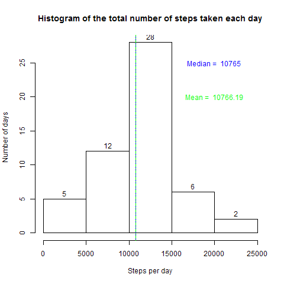
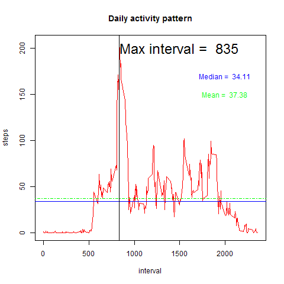
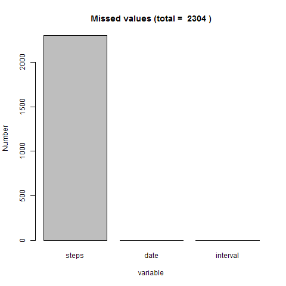
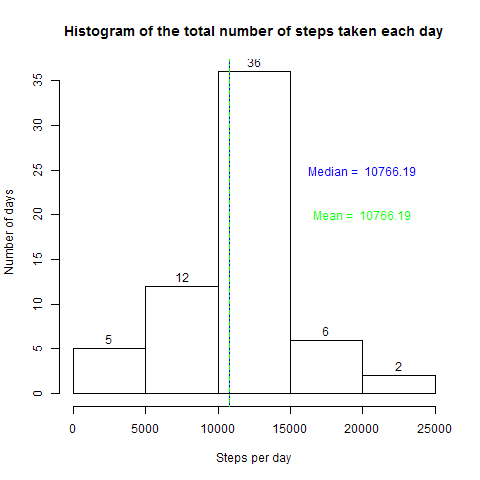
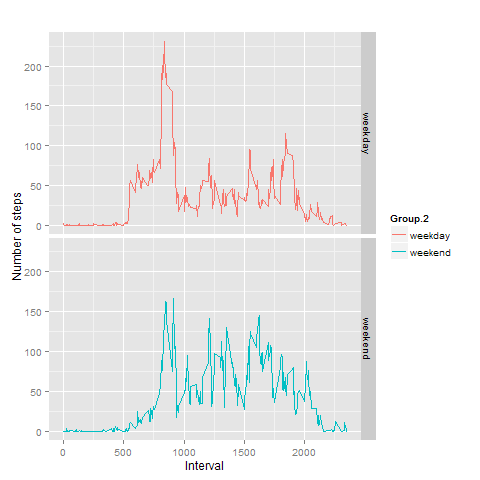

## Loading and preprocessing the data
 
### 1. Setting Working directory

rm(list=ls())
setwd("C:/Users/vlasenko/YandexDisk/R_Programming/5_CourseProj1/")
WorkingDir <- getwd()
print(paste("You can find data and results in ",WorkingDir))
DirName <- "RepData_PeerAssessment1"

### 2. Setting file names

Url <- "https://d396qusza40orc.cloudfront.net/repdata%2Fdata%2Factivity.zip"
F_name <- "repdata_data_activity.zip"
F_name_Data <- "activity.csv"

### 3. Downloading and unziping the data (if files aren't exist)

if( !(F_name %in% dir()) ) { download.file(Url, destfile = F_name) }
if( !(F_name_Data %in% dir()) ) { unzip(F_Name) }

### 4. Reading and  the data

data <- read.csv(F_name_Data)
library(lubridate)
data$date <- ymd(data$date)
setwd(DirName)

## What is mean total number of steps taken per day?

### 1. Evaluating sums of steps for each day (date), mean and median of sums

Sum <- aggregate(data$steps, by = list(data$date), sum)
md <- median(Sum$x,na.rm=TRUE)
mn <- mean(Sum$x,na.rm=TRUE)

### 2. Plotting histogramm and reporting the mean and the median

png(file="instructions_fig/Histogram_1.png",width=480,height=480)
hist(Sum$x, main="Histogram of the total number of steps taken each day", 
    xlab = "Steps per day", ylab = "Number of days", labels = TRUE)
text(20000, 25, paste("Median = ",md), col="blue")
text(20000, 20, paste("Mean = ",round(mn,2)),col="green")
abline(v=md, col="blue", lty = 19)
abline(v=mn, col="green", lty = 10)
dev.off()

### Median and mean number of steps taken per day:
print(paste("Median = ",md,"  Mean =", round(mn,2)))

## What is the average daily activity pattern?

### 1. Evaluating means of steps for each interval

Sum2 <- aggregate(data$steps, by = list(data$interval), mean, na.rm=TRUE)
md2 <- median(Sum2$x)
mn2 <- mean(Sum2$x)
MaxInt <- Sum2[Sum2$x == max(Sum2$x),1]

### 2. Plotting graph and reporting the mean and the median

png(file="instructions_fig/Plot_2.png",width=480,height=480)
plot(Sum2$Group.1, Sum2$x, type="l",col="red",main="Daily activity pattern", 
    xlab = "interval", ylab = "steps")
text(1500, 200, paste("Max interval = ",MaxInt),col="black",cex=2)
text(2000, 170, paste("Median = ",round(md2,2)), col="blue")
text(2000, 150, paste("Mean = ",round(mn2,2)),col="green",)
abline(h=md2, col="blue", lty = 19)
abline(h=mn2, col="green", lty = 10)
abline(v=MaxInt, col="black", lty = 1)
dev.off()

## Imputing missing values

### 1. Reporting missing values

library(plyr)
MissedValues <- apply(is.na(data),2,sum)
png(file="instructions_fig/Plot_3.png",width=480,height=480)
barplot(MissedValues,main=paste("Missed values (total = ", sum(MissedValues),")"), 
    xlab = "variable", ylab = "Number")
dev.off()

### 2. Filling missing values (and verify) using average daily activity pattern
dat0 <- mutate(data, CorrectedSteps = ifelse(is.na(steps),
        Sum2[match(interval,Sum2$Group.1),2], steps) )

missed <- as.integer(names(table(data[is.na(data$steps),3])))
missed_tbl <- cbind(missed,Sum2[match(missed, Sum2$Group.1),])
table(unique(dat0[is.na(dat0$steps),3:4]) == missed_tbl[,2:3])

### 3. Evaluating sums of steps for each day (date), mean and median of sums

Sum3 <- aggregate(dat0$CorrectedSteps, by = list(dat0$date), sum)
md3 <- median(Sum3$x,na.rm=TRUE)
mn3 <- mean(Sum3$x,na.rm=TRUE)

### 4. Plotting histogramm and reporting the mean and the median

png(file="instructions_fig/Histogram_4.png",width=480,height=480)
hist(Sum3$x, main="Histogram of the total number of steps taken each day", 
    xlab = "Steps per day", ylab = "Number of days", labels = TRUE)
text(20000, 25, paste("Median = ",round(md3,2)), col="blue")
text(20000, 20, paste("Mean = ",round(mn3,2)),col="green")
abline(v=md3, col="blue", lty = 19)
abline(v=mn3, col="green", lty = 10)
dev.off()

## Are there differences in activity patterns between weekdays and weekends?

### 1. Creating a new factor variable in the dataset with two levels – “weekday” and “weekend”

language <- "English"
Sys.setlocale("LC_TIME", language)
dat <- mutate(dat0, day = ifelse( (weekdays(dat0$date,abbreviate = TRUE)=="Sat")
| (weekdays(dat0$date,abbreviate = TRUE)=="Sun") , "weekend", "weekday"))

### 2. Evaluating means of steps for each interval

Sum4 <- aggregate(dat$CorrectedSteps, by = list(dat$interval, dat$day), mean, na.rm=TRUE)

### 3. Making a panel plot containing a time series plots for weekdays and weekends

library(ggplot2)
png(file="instructions_fig/Plot_5.png",width=480,height=480)
qplot(x=Group.1, y=x, data=Sum4, col=Group.2, facets=Group.2~., geom="line", xlab="Interval",ylab="Number of steps", main = "")
dev.off()

## Creating reports
knit2html("PA1_template.Rmd", force_v1 = TRUE)
